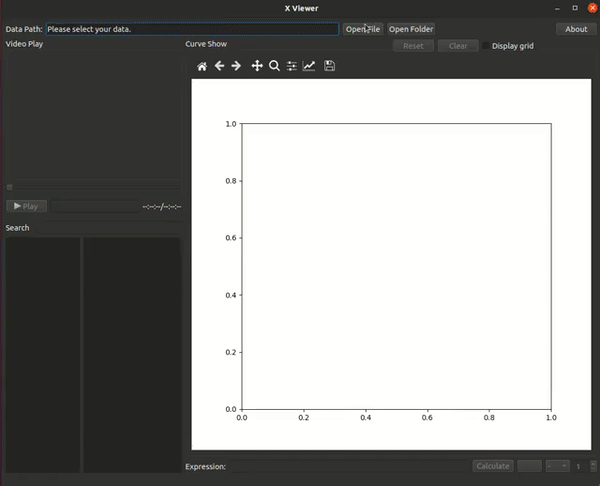
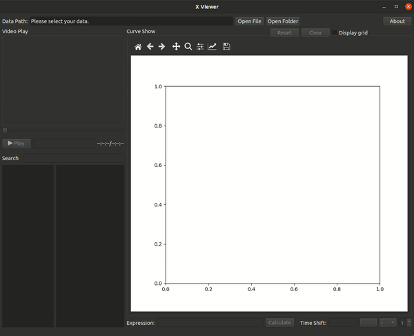

# XViewer

XViewer is a easy tools for data visualization. You can use it to visualize a data file or a data dir such as EuROC, TUM RGBD dataset as well as user-defined data.

When you developing your algorithms, you can log the algorithms data into a file in table format. Then you can use XViewer to watch the data you saved.

|watch table files|watch dataset dir|
|--|--|
|||

## Dependencies
```
conda create -n xviewer python=3.8.0
conda activate xviewer
pip install -r requirements.txt
```

## How to run
```
python src/run.py
```

### Try open a table file
- Click 'open file', select 'data/imu.csv', then data will be loaded.
- Try clicking the items in variable list, you will see curve in axes.

### Try open EuROC dataset
- Download [EuEOC dataset](http://robotics.ethz.ch/~asl-datasets/ijrr_euroc_mav_dataset/) zip file and unzip it.
- Copy format file [cfg/format_euroc.yaml](./cfg/format_euroc.yaml) into EuRoC data dir(under 'mav0')
- Click 'open dir', select your EuRoC data dir, such as '<data_dir>/MH_01_easy/mav0'. click 'play', you will see video play.

### Try open TUM RGBD dataset
- Download [TUM RGBD dataset](https://vision.in.tum.de/data/datasets/rgbd-dataset) tgz file and extract it.
- Copy format file [cfg/format_tum_rgbd.yaml](./cfg/format_tum_rgbd.yaml) into data dir.
- Click 'open dir', select your data dir and play.

### Try open other dataset
- This viewer is easy to support other dataset, such as KITTI, TUM-VIO dataset. One can modify format yaml according to dataset file organization.

### Try open your DIY data set
- Copy 'cfg/format.yaml' into your data dir
- Modify this yaml according to your own data.
- There is a DIY sample data, one can use viewer to open [data/sample_video](./data/sample_video/) to see how it works.

## Data Format
1. file or files: see [example_file](./data/imu.csv), each line is one data frame, each column splited with charactor ' ' or ','. Use '#' for comment line.
If first line is comment line, colnames will be deduced from first line comment.
2. data dir: see [example_dir](./data/sample_video/), copy [format.yaml](./cfg/format.yaml) into your data dir and modify it according to your own data, if format.yaml not in data dir, the default 'cfg/format.yaml' will be used.

## Develop
Using qt designer to open .ui file and drad your widgets to layout. Then, convert .ui to .py using the folling command:
```
   pyuic6 interface.ui -o interface.py
```
